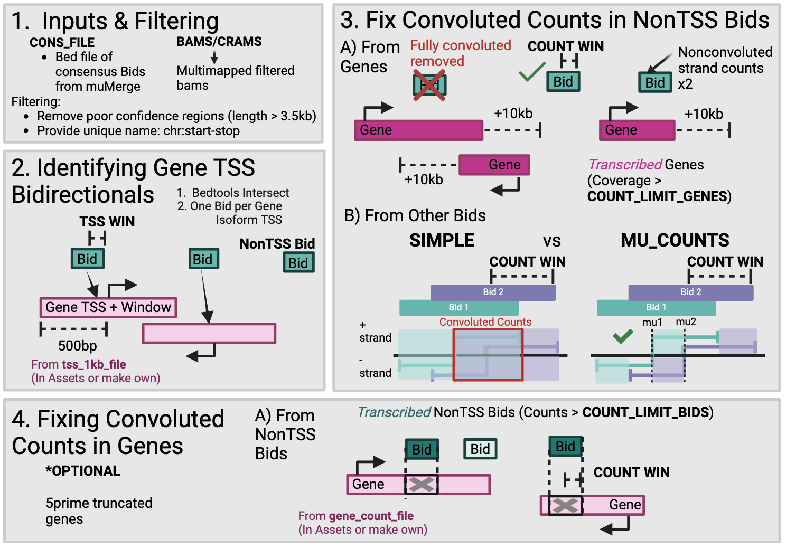

# Bidir_Counting_Analysis
This repository is a generalizable pipeline for getting bidirectional and gene counts from Nascent sequencing data while accounting for overlapping transcription, and the different transcriptional patterns of gene 5prime bidirectionals and enhancers. The counts (suggested) or combined files can also be fed directly into [TFEA](https://github.com/Dowell-Lab/TFEA). Details of the pipeline can be found in "How it Works." 

## Installing and Testing:
* Nextflow (version >= 19.10.0, but the latest versions also appear to cause difficulties) You can easily run an older version of nextflow without reinstalling by specifying in the nextflow command, i.e. NXF_VER=19.10.0 nextflow run .... We tested using this nextflow version 20.07.1.5412.
* bedtools (2.28.0 tested)
* samtools (1.8 tested)
* subread (1.6.2 tested)
* R (3.6 - 4.4 tested)
    * data.table
    * stringR
    * If on a supercomputer (e.g. Fiji), you can get data.table and stringR installed by *interactively* running the code below. You'll get an alert that the opt/R is not writable so it must install data.table into a personal R directory that it will store in a location it provides (usually ~/R/x86_64-pc-linux-gnu-library or some variation). You can say YES to this. From now on, when you install packages, they will be stored here.
        ```
        module load R/4.4.0
        R
        >install.packages("data.table")
        >install.packages("stringR")
        ```


* python >3 (3.6 & 3.9 tested)
    * pandas (2.2.2 and 2.0.3 tested with python 3.9)
    * numpy (1.26.5 and 1.25.2 tested with python 3.9)
    * If on the supercomputer, pandas is not available for python 3 so you need to make a conda or pip environment and activate this before running the nextflow pipeline::
      ```
      conda create -n python39
      conda activate python39
      conda install python=3.9.17 numpy=1.25.2 pandas=2.0.3
      ```

#### Testing it
Run the `example_run.sbatch` and look in tests/out/ to double check that you can run it successfully. 

You must make the following edits to the file:
1. The error and output paths (lines 3 & 4)
2. The variable SRC_DIR (point based on where you house this repository)
3. The path to the conda environment (line 24)

You should get the following output in tests/out:
    * counts/
        * fixed_genes_Testing_8.29.25_counts.txt
        * fixed_genetss_Testing_8.29.25_counts.txt
        * fixed_nongenetss_Testing_8.29.25_counts.txt
        * fixed_MU_genetss_Testing_8.29.25_counts.txt
        * fixed_MU_nongenetss_Testing_8.29.25_counts.txt
    * regions/
        * nontss_bid_Testing_8.29.25_forTFEA.bed
        * tss_bid_Testing_8.29.25_forTFEA.bed
        * tss_bid_Testing_8.29.25.txt
        

 
-------------------------------------------------------------
## Running Bidir_Counting_Flow
### Usage
* **Note**: -work-dir is a nextflow argument, not main.nf argument, hence make sure it is done as -work-dir (not --work-dir). Otherwise, it will create a working directory in the folder where you run the command.
```
nextflow run main.nf \
 --mmfiltbams path/to/mmfiltbams \
 --cons_file path/to/consensus/regions \
 -work-dir /path/to/working/directory \
 --outdir /path/to/output/directory \
 --prefix desired_prefix \
 --count_win 500 \
 --date 2.11.25 
```

### Arguments
```
Required arguments:
    --cons_file                   bed file with consensus bidirectionals/tREs of interest where the midpoint of the 2nd & 3rd columns is closest to mu (often with muMerge)
    --mmfiltbams                  Directory pattern for multimap filtered bams: "/project/*.mmfilt.sorted.bam" (Required if --bams or --crams not specified).
    --crams                       Directory pattern for cram files: "/project/crams" (Required if --mmfiltbams or --bams not specified).
    --bams                        Directory pattern for bam files: /project/*.sorted.bam (Required if --mmfiltbams or --crams not specified
    -workdir                     Working directory where all intermediate files are saved by Nextflow. (You'll probably want to clear this after running everything with no errors)

Save options:
    --outdir                       Specifies where to save the output from the nextflow run.
    --prefix                       Prefix used in output files (default = "count_project")  
    --savemmfiltbams               Saves multimapped read filtered bamfiles used for tfit (default 'TRUE')
    --date                         added to prefix in output files
    --tfea                         If you want the TSS and NonTSS bidirectionals separated and in a format to be provided to TFEA as a combined_file, this should be "TRUE" (default="TRUE").

Analysis Options:
    --make_names                   If the cons_file does NOT have a column 4 with the names, a unique name will be added for each feature (default="YES")
    --count_win                    Window added from mu to consider for initial counting of bidirectionals (so if 1000 --> 2000bp region) (default=1000)
    --tss_win                      Window added from mu to overlap bidirectionals with gene TSS windows to identify 5' gene bidirectionals (default=25)
    --count_limit_genes            Minimum coverage (fraction of gene covered by reads) required to consider a gene transcribed and possibly convoluting transcription (default=0.7)
    --count_limit_bids             Minimum total counts summed from all samples required to consider a bidirectional possibly convoluting gene transcription (default=30)
    --get_fixed_genecounts         Whether or not you want to get counts for genes after removing strongly transcribed bidirectionals overlapping genes (if don't want then make "FALSE")

Files to Use (with Defaults):
    --genome                       Only needed if --crams is used (default is /scratch/Shares/dowell/genomes/hg38/hg38.fa)
    --tss_1kb_file                 sorted bed file with 500bp region +/- around TSS of all genes (including putatives) (Default in assets of github repo)
    --gene_put_file                sorted bed file of all gene isoforms (Default in assets of github repo)
    --gene_put_10kbdntm_file       sorted bed file of the termination site of gene isoforms to 10kb downstream (Default in assets of github repo)
    --gene_count_file              sorted bed file of 5prime truncated genes over which you want to count 
```
**WARNING** Including getting the fixed genecounts can take awhile due to using bedtools coverage. 


### Example Run on Fiji
```
#!/bin/bash
#SBATCH --job-name=BidirCountFlow_WSP
#SBATCH --output=/scratch/Users/hoto7260/nextflow_out/Bidir_Count/e_and_o/UWA_%j.out
#SBATCH --error=/scratch/Users/hoto7260/nextflow_out/Bidir_Count/e_and_o/UWA_%j.out
#SBATCH --time=24:00:00
#SBATCH --nodes=1
#SBATCH --ntasks=1
#SBATCH --mem=1G
#SBATCH --partition short
#SBATCH --mail-type=FAIL,END
#SBATCH --mail-user=hoto7260@colorado.edu

module load samtools/1.8
module load bedtools/2.28.0
module load openmpi/1.6.4
module load gcc/7.1.0
module load subread/1.6.2
module load R/4.4.0

source activate /Users/hoto7260/miniconda3/envs/python39
# python 3.9.17
# numpy  1.25.2
# pandas 2.0.3
 
 ## Clear the wokring directory
 work_dir=/scratch/Users/hoto7260/nextflow_out/Bidir_Count/tmp
 rm -rf ${work_dir}
 
 ## Run your code
/scratch/Shares/dowell/dbnascent/pipeline_assets/nextflow run /Users/hoto7260/src/Bidir_Counting_Analysis/main.nf \
 --crams "/scratch/Users/hoto7260/nextflow_out/Nascent/ADP_smAECs_03-4-24/mapped/crams/" \
 --cons_file /Users/hoto7260/projects/Resp_Env/Comb_UPM_WSP_ADP/mumerge/out/UPM_WSP_ADP_tfit_MUMERGE.bed \
 -work-dir ${work_dir} \
 --outdir /scratch/Users/hoto7260/Resp_Env/Comb_UPM_WSP_ADP/ADP \
 --prefix CUWA_ADP \
 --date 3.26.25 \
 --count_limit_bids 60 \
 --gene_put_file /Users/hoto7260/src/Bidir_Counting_Analysis/assets/hg38_refseq_diff53prime_with_putatives_fixnames_sort2.sorted.bed

# OR WITH BAMS and no fixed counts for genes
/scratch/Shares/dowell/dbnascent/pipeline_assets/nextflow run /Users/hoto7260/src/Bidir_Counting_Analysis/main.nf \
 --mmfiltbams "/scratch/Users/hoto7260/nextflow_out/Nascent/ADP_smAECs_03-4-24/mapped/mmfiltbams/*.bam" \
 --cons_file /Users/hoto7260/projects/Resp_Env/Comb_UPM_WSP_ADP/mumerge/out/UPM_WSP_ADP_tfit_MUMERGE.bed \
 -work-dir ${work_dir} \
 --outdir /scratch/Users/hoto7260/Resp_Env/Comb_UPM_WSP_ADP/ADP \
 --prefix CUWA_ADP \
 --date 3.26.25 \
 --count_limit_bids 60 \
  --get_fixed_genecounts "FALSE"
```

## How it works?


Nascent transcription occurs outside the bounds of gene annotations. Bidirectionals are often near genes and other bidirectionals, making capturing their transcription without capturing noise difficult. Therefore, this pipeline addresses these problems with the following solutions:

1 . Filtering Inputs:
* **Significance**: Remove bidirectionals that are likely called due to technical noise
* **Solution**: muMerge lengths correspond mostly to confidence intervals around mu (slightly length of calls as well). Therefore if the confidence interval is above 3.5kb, we remove the call.

2 . Identify Gene TSS Bidirectionals:
* **Significance**: Genes have bidirectionals at their 5' ends (often called PROMPTs). These have very different transcriptional patterns to enhancer bidirectionals and are technically part of the gene. Therefore, these bidirectionals should not be treated the same.
* **Solution**: TSS bidirectionals (5' bidirectionals of genes) are identified by overlapping the bidirectionals with a small window (TSS_WIN=default=25bp) with a window around the TSS of genes (including putative) (tss_1kb_file). TSS bidirectionals are assigned so that a single gene isoform only has one TSS bidirectional with the one whose midpoint is closest to the TSS used. Two gene isoforms are allowed to share the same TSS bidirectional if their TSS are within 50bp of each other.

3A. Address overlapping transcription from genes:
* **Significance**: Transcription of genes continues downstream of their annotations and most enhancer bidirectionals are found within the introns of genes (whether the genes are transcribed or not).
* **Solution**: Genes considered transcribed (COUNT_LIMIT_GENES=70% isoform covered with reads) and 10kb downstream of them are overlapped with nonTSS bidirectionals. TSS bidirectionals by requirement will overlap genes. Any nonTSS bidirectional overlapping gene transcription on one strand is counted according to its strand without convolution doubled. Any nonTSS bidirectional overlapping gene transcription on both strands is removed since deconvolution cannot confidently occur.

3B. Address overlapping transcription from bidirectionals with other bidirectionals:
* **Significance**: Bidirectionals can often be close to one another so that a fixed region length captures multiple at once. However, bidirectional transcript lengths can also widely vary. 
* **Solution**: "MU_COUNTS" fixes this as described further in "More about Inputs and Outputs."

4 . Address overlapping transcription from bidirectionals within genes:
* **Significance**: [Azofeifa et al](https://ieeexplore.ieee.org/abstract/document/7393555) showed that differential gene expression analysis can be largely disrupted by counting capturing differences between bidirectionals within genes rather than the genes themselves.
* **Solution**: If get_fixed_genecounts=TRUE, the count regions of bidirectionals with reads > COUNT_LIMIT_BIDS after deconvolution are removed from gene regions over which to be counted.


## More about Inputs and Outputs
### Two Major Inputs
* **MMFILTBAMS**
    * These are bams that have already been filtered for multimapped reads. If you do not have these, you can instead use the crams or bams directory.
* **CONS_FILE**
    * This is a bed file (tab-delimited with no header) with a minimum of three columns: Chromosome, start, end. The midpoint between the start and end should be the estimated center of the bidirectional (transcription start site of the bidirectional). A robust way to get these sites is running [muMerge](https://github.com/Dowell-Lab/mumerge). 

### Parameters
* **COUNT_WIN**
    * This is the window around the midpoint of a bidirectional used to count it. If using count_type-"SIMPLE", thisx2 will be the total region length counted over. If using count_type="MU_COUNTS", thisx2 will be the  region length counted over unless there is overlapping transcription from another bidirection.
    * (new_start=mu-COUNT_WIN & new_stop=mu+COUNT_WIN)
    * Recommended to start: 1000 (so 2kb regions lengths), and no greater than 3000 (benchmarking saw no increase in information after 6kb region lengths)
* **TSS_WIN**
    * This is the window around the bidirectional midpoint to see if it overlaps with 500bp windows around gene transcription start sites. 
    * Recommended: Default= 25bp (so 50bp region length)
* **COUNT_LIMIT_GENES**
    * This is the minimum coverage required of a gene to be considered "transcribed" enough to have transcription convolute transcription of bidirectionals overlapping or directly downstream of the gene.
    * Default = 0.7 (so 70% of the gene has transcriptional coverage)
    * Note: The coverage is calculated based on reads from ALL provided bams. 0.7 has served well for 4-6 bams but may be low if using more samples than that and high if using fewer.
* **COUNT_LIMIT_BIDS**
    * The number of reads required to be overlapping a bidirectional (only strands not convoluted by gene transcription) for it to possibly be convoluting the transcription counts of a gene. 
    * Note: The total reads is based on ALL provided bams. 30 (default) has served well for 4-6 bams with 40M reads, but may be low if using more samples than that and high if using fewer. 

### Output 
* mmfiltbams/ (**if savemmfiltbams**)
* regions/
    * TSS bidirectionals: `tss_bid_${prefix}_${date}.txt`
    * TSS bidirectionals bed (for TFEA): `tss_bid_${prefix}_${date}_forTFEA.bed` (**if TFEA**)
    * NonTSS bidirectionals bed (for TFEA): `nontss_bid_${prefix}_${date}_forTFEA.bed` (**if TFEA**)
* counts/
    * fixed counts for the genes: `fixed_genes_${prefix}_${date}_counts.txt` (**if get_fixed_gene_counts**,  **can be fed into TFEA**)
    * (MU_COUNTS) fixed counts for the Gene TSS bidirectionals: `fixed_MU_genetss_${prefix}_${date}_counts.txt`
    * (MU_COUNTS) fixed counts for the Non Gene TSS bidirectionals: `fixed_MU_nongenetss_${prefix}_${date}_counts.txt` 
    * (SIMPLE) fixed counts for the Gene TSS bidirectionals: `fixed_genetss_${prefix}_${date}_counts.txt`
    * (SIMPLE) fixed counts for the Non Gene TSS bidirectionals: `fixed_nongenetss_${prefix}_${date}_counts.txt` 


#### Difference between MU_COUNTS and SIMPLE
    
* The "SIMPLE" approach uses a fixed window (COUNT_WIN) around the centers of the consensus regions providing without worrying about neighboring bidirectionals, and considering the entire region for positive and negative counts (doesn't split into transcripts).
* The "MU_COUNTS" approach uses a fixed window (COUNT_WIN) for the region of the tRE BUT has two additions (Image below to help visualize):
  1) Considers overlapping regions: If a fixed counting window means the given regions are now overlapping, the neighboring tREs will be counted so that the maximum distance of a transcript is to the middle (mu) of the nearest neighboring tRE.
  2) Considers transcripts of each region separately: Assuming each consensus region is a bidirectional (transcripts from both strands originating at the midpoint of the region (mu)), we then count each transcript separate from one another. This allows more exact deconvolution of overlapping bidirectionals while maintaining as much data as possible.


## Troubleshooting
* Is it "finishing" in 15 seconds but nothing is output?
    - For some reason, this version of nextflow is EXTREMELY picky on how a folder or set of files is directed to it as input. Therefore, make sure you are using the following notation.
      ```
      # for crams just point to the folder with quotations
      --crams "/scratch/Users/hoto7260/tmp/crams/"
      # for mmfiltbams point to the folder WITH an asterick for the bams
      --mmfiltbams "/scratch/Users/hoto7260/tmp/mmfiltbams/*.bam"
      ```
* Error about improper sorting of a bed or bam file?
    - Sometimes the bam file is sorted in a different order than the bed file (most commonly a difference of chr1, chr2, ... chr10 vs chr1, chr10, ... chr2). One of the steps uses bedtools coverage to calculate coverage of genes. The default bed file for this is "assets/hg38_refseq_diff53prime_with_putatives_fixnames.sorted.bed" but if the above is occuring, try using "assets/hg38_refseq_diff53prime_with_putatives_fixnames_sort2.sorted.bed" in --gene_put_file. This file has the chr1,chr2 ... ordering. If this still does not work, you can reorder the bed file to match the bam by using the -g option of bedtools sort where the -g refers to a file of the chromosomes in the order used in the fasta file used to produce your bam.
 
## Citing
If using this pipeline, please cite ...

## Contact Information
If you have questions, reach out to hope.townsend@colorado.edu.


